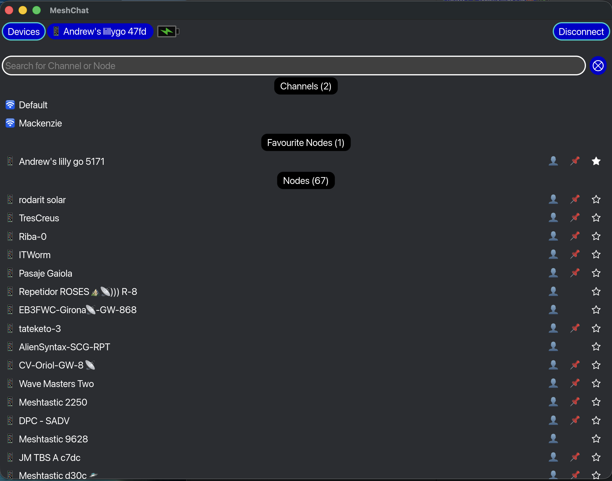
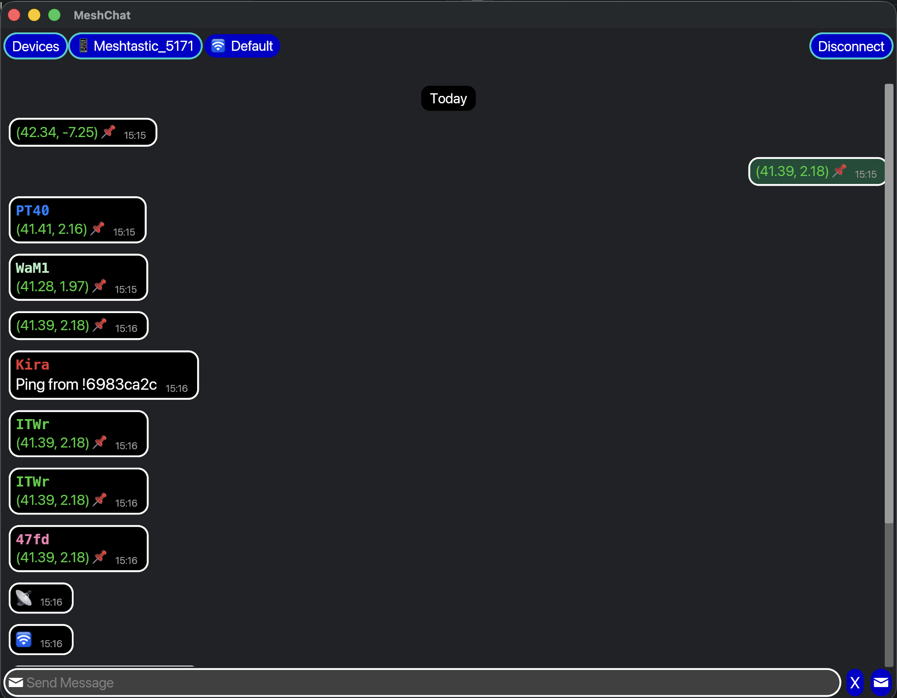

#  MeshChat

Meshchat is an Iced cross-platform GUI application to interact with Meshtastic LoRa radios:

- find Bluetooth Low Energy attached meshtastic devices
- connect to one
- use it to chat with others using the available channels or direct messages to Nodes
- it saves the last device connected to (and channel if applicable), and on re-start it will try to
  automatically reconnect to that and continue chatting

## Screenshots

On the left, the Device view, once you have connected to a BLE Radio, shows configured channels, a list of nodes
found and nodes you have marked as a favorite.

On the right, the Channel view, Once you have clicked on a channel or a node, shows you the ongoing chat messages with
it,
with your messages on the right and others on the left.

<!--suppress ALL -->
<table cellspacing="0" cellpadding="0" border="0">
  <tr>
    <td valign="top">
      
    </td>
    <td valign="top">
      
    </td>
  </tr>
</table>

## Disclaimer

*** WARNING: Alpha quality, and few automated tests! ***

Since the app doesn't try to change the configuration of any attached radio, at most it tries to send
messages, the risk of "damage" from any bug is kind of low.

Here is the list
of [Known Bugs](https://github.com/andrewdavidmackenzie/meshchat/issues?q=is%3Aissue%20state%3Aopen%20label%3Abug)

## The Thinking

My thinking was to keep the app as simple to look at and use as possible.

- avoid the app being an extremely geeky LoRa/Mesh app.
- try to give users a simple chat experience, similar to ones they will be accustomed to with WhatsApp, Telegram,
  etc.
- you will need to use some other app to configure their radio and join a mesh

I've made some unusual (and questionable) UI choices even in the minimal UI I have. They just kind of
materialized as I went, and I don't claim it's great...If people can use it easily, great. If not, help is welcome
to improve it.

## Newer Features

Here are some of the newer features I have added in recent releases:

### 0.2.0 Release

This is the first "real" release I've done via GitHub releases. It includes:

- Discover nearby MeshTastic compatible radios via Bluetooth and list them in the Device View
- Connect to a MeshTastic radio, then view a list of Channels and Nodes it knows about
- Filter the list of Channels and Nodes by name
- Start a chat with a Channel or a Node, viewing messages received and send new messages
  (Text, Text Reply, Position, Alert, NodeInfo)
- Acknowledgement indicator on message to show it was received by the other side
- Unread message count indicator on Channels, Nodes and Device overall
- macOS and Linux application bundles are included in the GH Release Artifacts (Windows is still broken)
- Ability to Reply to a message, show replies quoting the original message
- Ability to Forward a message to another Channel or Node
- Ability to Copy a message to the clipboard to be pasted elsewhere
- Ability to React to a message with an emoji
- Ability to start a DM with a Node from its name in a message
- Empty views for Device List and Channel/Node View when there is nothing to see, with some instructions
- Ability to Send your radio's current position
- Ability to Send your node's info
- Show the battery level of the connected radio in the header
- Ability to alias a BlueTooth Device with a more friendly or memorable name of your choosing
- Ability to alias a Node with a more friendly or memorable name of your choosing
- Ability to favourite Nodes and show the list of Favourite nodes at the top of the Device View
- Button on each node in the Device View to allow you to see its position (on Google Maps)

## Discussions

I have enabled [GitHub discussions](https://github.com/andrewdavidmackenzie/meshchat/discussions), so if you want to
talk about things, jump in there.

In particular, I am interested in hearing users thoughts
about [storing chat history locally](https://github.com/andrewdavidmackenzie/meshchat/discussions/145)

## Supported OS

Meshchat uses the `Iced`, `Meshtastic` and other rust crates that are all cross-platform, so it should run on
many Operating Systems, including macOS, Windows and Linux.

So far, I have used it successfully on:

* macOS (Tahoe)
* Linux (Pop OS!)
    * Known [bug](https://github.com/andrewdavidmackenzie/meshchat/issues/16) in BLE device discovery—it detects all
      BlueTooth devices, not just Meshtastic radios

If you successfully run it on other OS or variants of the above, drop me a message in the repo's
[discussions](https://github.com/andrewdavidmackenzie/meshchat/discussions) with some details, and I will add to a list
of known working OS.

## CI Testing

Tests are run in GitHub actions on macos-15, ubuntu-latest and window-latest. Coverage is still low, but now
at least I am measuring it and working to increase it gradually.

## Supported Radios

It should work with all Meshtastic radios that are supported by the Meshtastic rust crate.

So far, I have tested with a LillyGo T-ECHO and a T-Deck Pro

Again, if you get it working successfully with other radios, drop me a message in
[discussions](https://github.com/andrewdavidmackenzie/meshchat/discussions) and I will create some list of known working
radios.

## Installing

For now, it's very rust-developer-oriented. If you have a working rust toolchain installed, then use:

`cargo install meshchat`

to get the binary built and installed and in your `$PATH`.

Later I may work on pre-build binaries attached to GitHub releases,
or `cargo binstall` support to make it easier.

### Binary Size

After a bit of optimizing I did, the release binary size is around 5.6 MBytes

## Running

If you clone the repo, you can run meshchat directly with:

`cargo run --release`

## Users wanted! / Help wanted!

I did this as a bit of an experiment to see if I could get it working with real hardware and the mesh, which
I did, so I am delighted.

If you use it successfully on some new OS variant, or LoRa radio, please drop me a message in the discussions.

I may (as usual) play with some aspects of it to learn more rust or Iced or specific things (e.g., I really need
to knuckle down and learn about theming and styling in Iced...).

But I would only invest significant amounts of time if I see real interest and usage from people. I have other
open source toy projects that keep me busy without this one—the one with the most traction from users will be
the one that gets more of my time.

## Remaining work / Contributing

I add to the [GitHub Issues](https://github.com/andrewdavidmackenzie/meshchat/issues) as they occur to me. I have
marked a few with the "help needed" label, but I would basically welcome help in any area, no matter how small.

Help from someone with some real UI / UX chops would be great.

Major areas of work remaining I would call out are:

- Review / Re-Implement a lot of the styling in Iced, using Themes and respecting the OS theme settings
- Improve the testing, probably using new (0.14.0) Iced test facilities
- Fix Windows bundling
- Chat history persistence (or not, as
  per [discussion](https://github.com/andrewdavidmackenzie/meshchat/discussions/145))

If you want to help out, submit a well-written issue, start
a [discussion](https://github.com/andrewdavidmackenzie/meshchat/discussions) or clone the repo and submit a PR.

### MeshCore Support

I keep an eye on MeshCore too, and if there was a reasonable rust crate to talk to MeshCore radios, I would
consider working on supporting both simultaneously. That would force cleaning up MeshTastic code that has
leaked into the MeshChat code, abstracting away the radio specifics.

## Licensing

These are the top-level dependencies of meshchat and their licenses:

* meshtastic - [GPL-3.0 License](https://github.com/meshtastic/rust/blob/main/LICENSE)
* iced - [MIT License](https://github.com/iced-rs/iced/blob/master/LICENSE)
* iced_futures - Inherits from iced, so MIT
* directories - Apache Version 2, or MIT license at your option

So, due to the meshtastic license, this project is also licensed under the [GPL-3.0 License](LICENSE)
